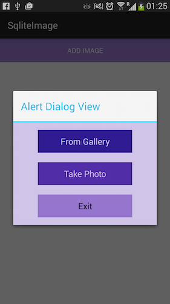
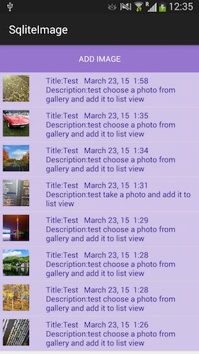
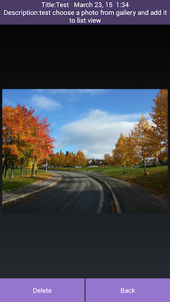
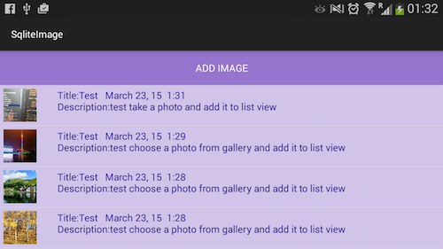
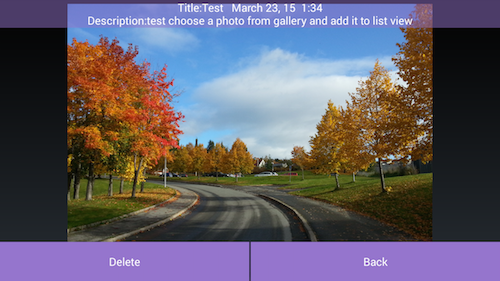
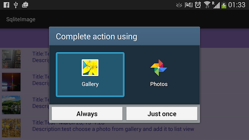

Choose Image from Gallery or Camera, display in a ListView and save 
information in SQLite
--

Main view when start

Popup window for options

ListView in main window: Portrait View

ImageView in image view window: Portrait View

ListView in main window: Landscape View

ImageView in image view window: Landscape View

Popup window for options: choose photo from gallery, Landscape View

