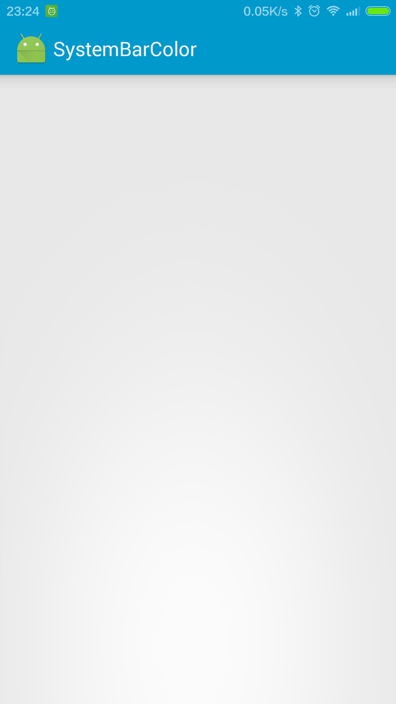
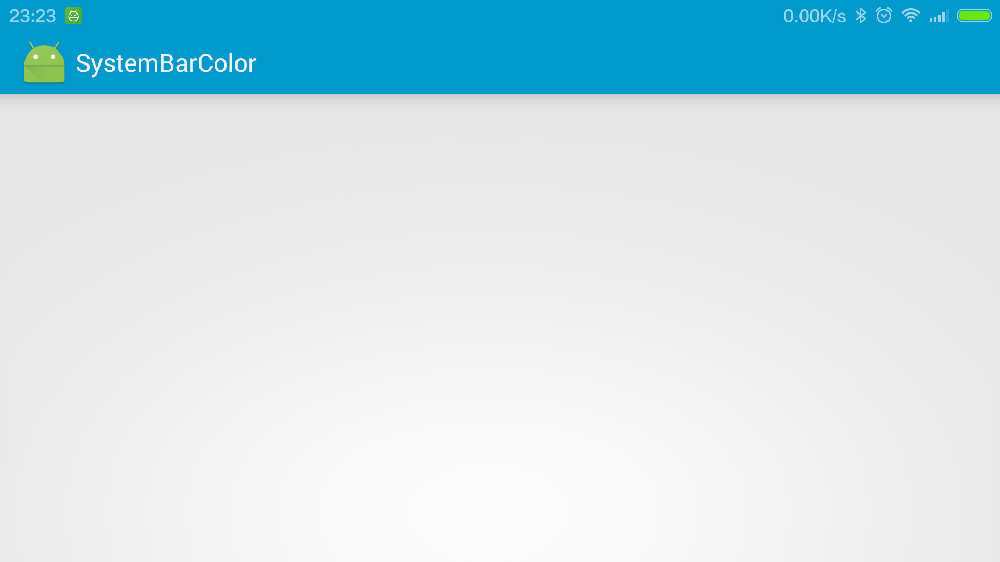

#Customize the Status Bar

The material theme lets developers easily customize the status bar, developers can specify a color that fits their
brand and provides enough contrast to show the white status icons.

but

The material theme is only available in Android 5.0 (API level 21) and above.

We can achieve change status bar color in other ways for Android 4.4 (API level 19) and above.

this is how it looks like on Android 4.4:

