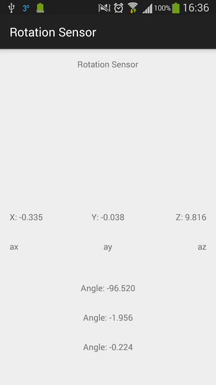

Android: Rotation Sensor
==

Use Accelerometer to calculate mobile moving angles:

Accelerometer provides: accelerate at: x, y, z axis, 

use

```
        anglexy = (float) (Math.atan2(ax, ay) / (Math.PI / 180));
        anglexz = (float) (Math.atan2(ax, az) / (Math.PI / 180));
        angleyz = (float) (Math.atan2(ay, az) / (Math.PI / 180));
```
to calculate the angles


Screenshot:
--

