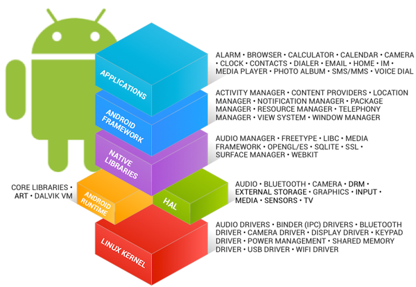

Android System Architecture
--

Android stack
--
Android is an open-source software stack created for a wide array of devices with different form factors.

Android Low-Level System Architecture
--

####Application framework
the level that most application developers concerns with.

####Binder IPC
The Binder Inter-Process Communication mechanism allows the application framework to cross process boundaries and call into the Android system services code.

This basically allows high level framework APIs to interact with Android's system services.

####System services 
Most of the functionality exposed through the application framework APIs must communicate with some sort of system service to access the underlying hardware.

Services are divided into modular components with focused functionality such as the Window Manager, Search Service, or Notification Manager.

System services are grouped into two buckets: 
- System and media.
- The system services include things such as the Window or notification Manager.
- The media services include all the services involved in playing and recording media.

####Hardware abstraction layer (HAL)
The HAL serves as a standard interface that allows the Android system to call into the device driver layer while being agnostic about the lower-level implementations of your drivers and hardware.

You must implement the corresponding HAL(and driver) for the particular piece of hardware that your product provides. 

Android does not mandate a standard interaction between your HAL implementation and your device drivers.

HAL implementations are typically built into shared library modules (.so files).

####Linux Kernel
Device drivers is the same as developing a typical Linux device driver for the most part. 

Android uses a specialized version of the Linux kernel with a few special additions such as wakelocks ...

topic
--
[Android Studio](AndroidStudio.md)

[Android Build Process](buildprocess.md)

[Developer Workflow](DeveloperWorkflow.md)

[Android System Architechture](androidSystemArchitechture.md)

[Gradle](Gradle.md)

[Design](design.md)
